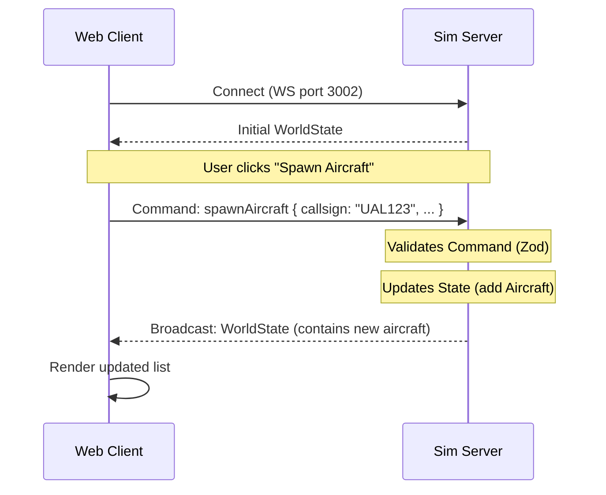

# Architecture

## Server-Authoritative Simulation

The simulation is **server-authoritative**. All logic regarding aircraft movement, spawning, and collision detection happens on the `apps/sim` server.

### Tick Loop
The server runs a main loop (tick) that:
1. Processes incoming commands queue.
2. Updates physics/state for all aircraft (e.g., updating position based on velocity).
3. Broadcasts the new `WorldState` to all connected clients.

### Data Flow

### Shared Schemas
We use `zod` in `packages/shared` to share validation logic between the frontend (input validation) and backend (command validation).
